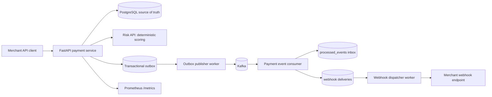

# ForgePay - Distributed Payment Processing Platform

[](https://github.com/wiktor-cl/forgepay/actions/workflows/ci.yml)

**Python / FastAPI / PostgreSQL / Kafka**

> **Recruiter snapshot:** backend-heavy portfolio project focused on transaction safety, idempotency, concurrency, event-driven processing and failure recovery. The repository includes integration, E2E, concurrency and resilience tests plus CI, migrations, metrics and architecture documentation.

ForgePay is a portfolio payment platform focused on correctness under failure: idempotent
money-changing APIs, PostgreSQL-backed financial invariants, transactional outbox, Kafka
at-least-once delivery, idempotent consumers, and signed webhook delivery with retry/DLQ/replay.



## Why It Is Technically Difficult

Payment systems fail in awkward places: clients retry, databases commit while brokers are down,
workers crash after receiving events, webhook receivers return 500s, and concurrent captures race
against the same balance. ForgePay keeps money state in PostgreSQL transactions, treats Kafka as
at-least-once, and makes externally visible side effects idempotent.

## Engineering Guarantees Demonstrated

- Idempotent payment creation with persisted request fingerprints and replayed responses.
- Explicit failed-authorization semantics: insufficient funds commits `FAILED` state and a
  `payment.failed` outbox event before returning HTTP 409.
- Concurrency-safe authorization/capture using row locks and database uniqueness constraints.
- PostgreSQL-backed posted journal guarantees: balanced entries, single currency, immutable rows.
- Transactional outbox for DB/Kafka consistency gaps.
- Kafka at-least-once delivery with idempotent consumer side effects through `processed_events`.
- Recoverable Kafka outage: committed outbox rows publish after Kafka returns.
- Per-endpoint encrypted webhook signing secrets, rotation, HMAC timestamp validation, retry,
  dead-letter state, audit-backed manual replay.

## Quick Start

```bash
python -m pip install -e ".[dev]"
docker compose up -d postgres redis kafka
alembic upgrade head
docker compose up -d --build
python scripts/demo.py
```

OpenAPI docs: `http://localhost:8000/docs`

## Tests

```bash
ruff check .
ruff format --check .
mypy libs services
python -m compileall libs services tests
pytest
```

The full pytest suite requires the Docker Compose stack. It includes unit, contract, PostgreSQL
integration, HTTP integration, concurrency, E2E, Kafka resilience, duplicate-event, and webhook
retry/DLQ/replay tests. GitHub Actions runs these checks in the `ci` workflow; the separate
`resilience` job repeats Kafka/webhook resilience tests on push to `main` and manual dispatch.

## Failure Demonstrations

```bash
python scripts/failure_demo.py
```

The demo runs real pytest scenarios against the local stack and prints PASS/FAIL for idempotency,
overspending protection, duplicate Kafka events, Kafka outage recovery, and webhook DLQ/replay.

## Observability

- Prometheus: `http://localhost:9090`
- Grafana: `http://localhost:3000`
- Service metrics: `http://localhost:8000/metrics`
- Health: `/health/live` and `/health/ready`
- Correlation: send `x-correlation-id`; it is returned by HTTP responses, stored in event
  envelopes, and forwarded to webhook receivers.
- OpenTelemetry scope: FastAPI request instrumentation is configured. There is no local collector
  or distributed trace backend in this portfolio version.

## Performance

`scripts/load_test.py` contains a small Locust scenario for create/read/capture traffic. Local
measurements and the exact command used belong in `docs/performance.md`; laptop numbers are not
presented as production capacity.

## What ForgePay Is Not

- Not a real payment processor.
- No card data and no acquiring/payment network integration.
- No PCI DSS, SOC 2, ISO 27001, or banking compliance claim.
- Risk scoring and provider funding are deterministic simulations.
