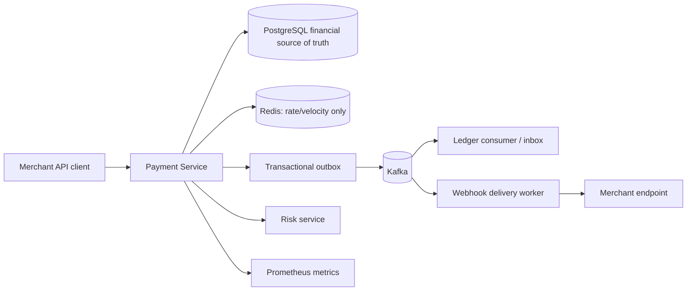

# ForgePay

Distributed payment processing platform built with Python + FastAPI.

ForgePay is a production-shaped portfolio system for demonstrating backend engineering depth:
state machines, idempotency, PostgreSQL transaction boundaries, double-entry accounting,
transactional outbox, at-least-once event handling, webhook retries, observability, and tests.



## Engineering Problems Demonstrated

- Concurrency: `SELECT ... FOR UPDATE`, uniqueness constraints, and transaction-scoped state changes.
- Idempotency: persistent request fingerprints and replayed responses keyed by merchant and key.
- Distributed transactions: transactional outbox instead of two-phase commit.
- At-least-once event delivery: processed-event inbox deduplication for consumers.
- Ledger correctness: immutable journal entries, integer minor units, balanced journals, no floats.
- Retries: bounded retry policies for Kafka/webhooks; no retries for permanent business failures.
- Failure recovery: outbox rows survive publisher crashes and Kafka outages.
- Observability: JSON logs, HTTP/Kafka/webhook correlation IDs, Prometheus metrics,
  FastAPI OpenTelemetry instrumentation, and a Grafana starter dashboard.

## Quick Start

```bash
python -m pip install -e ".[dev]"
docker compose up --build
alembic upgrade head
python scripts/demo.py
```

Payment service OpenAPI docs are available at `http://localhost:8000/docs`.

## Example Request

```bash
curl -X POST http://localhost:8000/api/v1/payments \
  -H "Authorization: Bearer fg_test_..." \
  -H "Idempotency-Key: 5e4e3bde-6eb1-4d4e-885b-a93026530a99" \
  -H "Content-Type: application/json" \
  -d '{"customer_id":"...","amount_minor":1000,"currency":"PLN"}'
```

The same key and same payload returns the original response. The same key with a different
payload returns an idempotency conflict.

## System Flow

1. Merchant creates a payment using an API key and an idempotency key.
2. Payment service evaluates deterministic risk rules.
3. Payment state and outbox event commit in the same PostgreSQL transaction.
4. Publisher asynchronously sends the event to Kafka with a stable event ID.
5. Consumers use `processed_events` to avoid duplicate side effects.
6. Webhook worker signs payloads and retries transient failures with bounded backoff.

## Test Commands

```bash
make lint
make type
make unit
pytest   # requires Docker Compose services for integration, E2E, and resilience tests
```

## Failure Demonstrations

```bash
python scripts/failure_demo.py
```

The script demonstrates duplicate idempotent requests against a running local service. The
pytest suite also executes real PostgreSQL concurrency tests, Kafka outage/outbox recovery,
duplicate Kafka event handling, and webhook retry/dead-letter/replay scenarios against the
Docker Compose stack. Additional scenarios are documented in
`docs/architecture/failure-recovery.md`.

## Observability

- Prometheus: `http://localhost:9090`
- Grafana: `http://localhost:3000`
- Service metrics: `http://localhost:8000/metrics`
- Health: `/health/live` is process-only; `/health/ready` checks required dependencies.
- OpenTelemetry is configured for FastAPI request spans. Worker correlation is carried with
  event envelope `correlation_id` values and forwarded to webhook receivers as `x-correlation-id`.

## What This Project Intentionally Does Not Claim

ForgePay is a portfolio/simulation system. It is not a certified payment processor, does not
move real money, does not claim PCI/SOC compliance, and does not integrate with real card
networks. Payment rails, provider records, and risk scoring are deterministic simulations used
to demonstrate architecture and reliability techniques.

## Important Trade-Offs

- PostgreSQL is the financial source of truth because database constraints and row locks are
  easier to reason about than distributed locks for money invariants.
- Redis is used only for ephemeral counters and velocity windows; losing Redis must not corrupt
  financial state.
- Kafka delivery is modeled as at-least-once. Consumers deduplicate instead of pretending
  exactly-once delivery across all side effects.
- Ledger entries are immutable. Corrections use compensating journals.
- Service boundaries are intentionally small: payment orchestration is central, while risk,
  ledger consumers, and webhooks represent separately scalable concerns.
