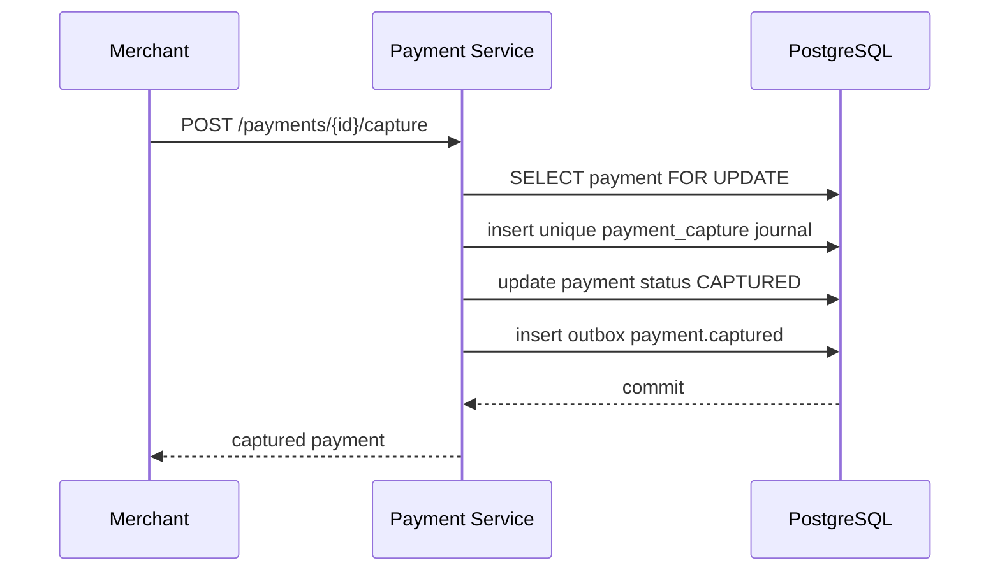

# Capture Sequence

```mermaid
sequenceDiagram
  participant M as Merchant
  participant P as Payment Service
  participant DB as PostgreSQL
  M->>P: POST /payments/{id}/capture
  P->>DB: SELECT payment FOR UPDATE
  P->>DB: insert unique payment_capture journal
  P->>DB: update payment status CAPTURED
  P->>DB: insert outbox payment.captured
  DB-->>P: commit
  P-->>M: captured payment
```
