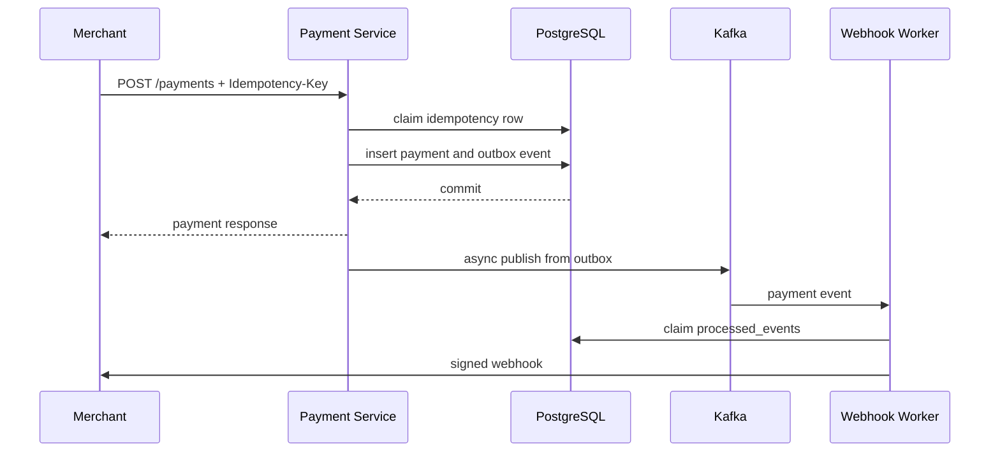

# Data Flow

```mermaid
sequenceDiagram
  participant M as Merchant
  participant P as Payment Service
  participant DB as PostgreSQL
  participant K as Kafka
  participant W as Webhook Worker

  M->>P: POST /payments + Idempotency-Key
  P->>DB: claim idempotency row
  P->>DB: insert payment and outbox event
  DB-->>P: commit
  P-->>M: payment response
  P->>K: async publish from outbox
  K->>W: payment event
  W->>DB: claim processed_events
  W->>M: signed webhook
```
