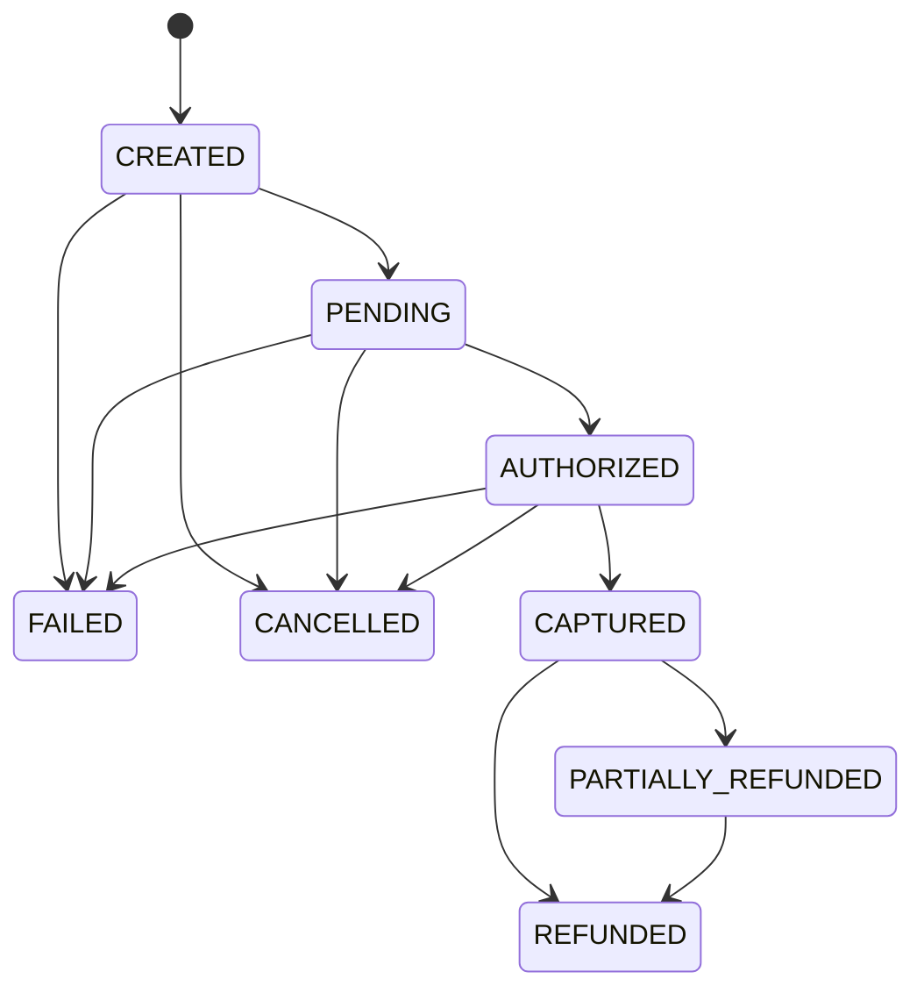

# Payment Lifecycle

```mermaid
stateDiagram-v2
  [*] --> CREATED
  CREATED --> PENDING
  CREATED --> FAILED
  CREATED --> CANCELLED
  PENDING --> AUTHORIZED
  PENDING --> FAILED
  PENDING --> CANCELLED
  AUTHORIZED --> CAPTURED
  AUTHORIZED --> FAILED
  AUTHORIZED --> CANCELLED
  CAPTURED --> PARTIALLY_REFUNDED
  CAPTURED --> REFUNDED
  PARTIALLY_REFUNDED --> REFUNDED
```

The state machine lives in code rather than scattered endpoint conditionals. Illegal transitions
return a consistent API error envelope.
