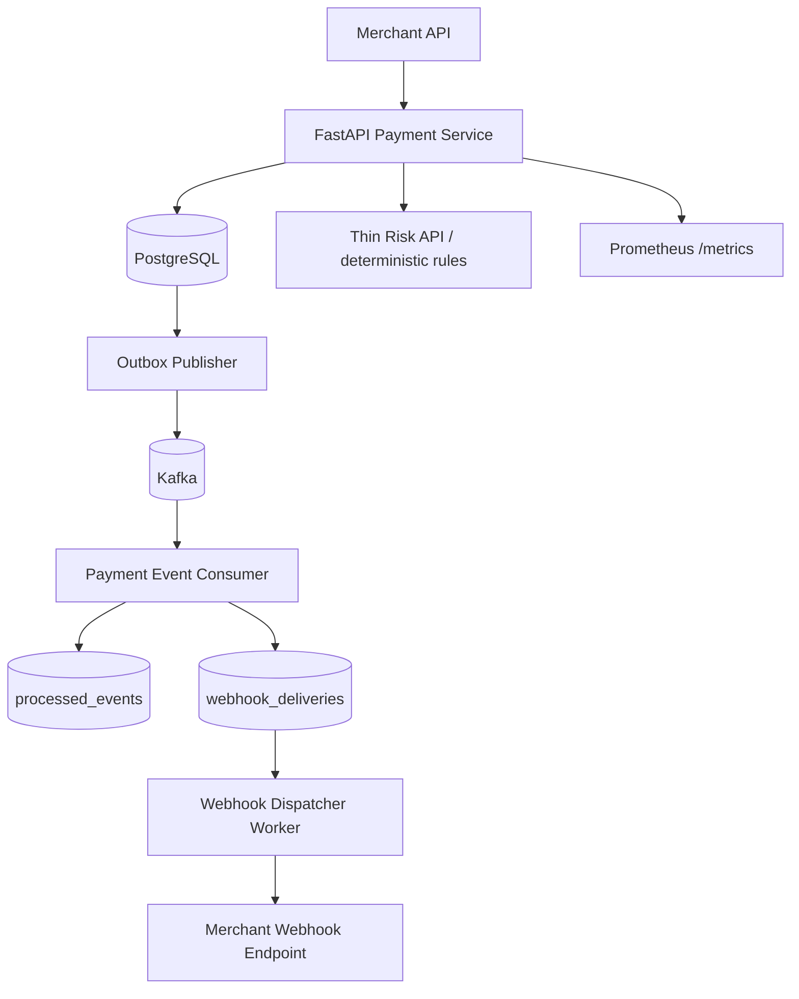

# System Overview

ForgePay is a simulated distributed payments platform. The payment service owns merchant-facing
API orchestration and transactional state changes. PostgreSQL owns financial truth. Kafka carries
events between workers. Redis is optional and never authoritative for money.

The main consistency boundary is a PostgreSQL transaction. Payment updates, audit rows, and
outbox events are committed atomically.

The ledger, risk, and webhook HTTP folders are intentionally small in this portfolio version.
The meaningful boundaries are the PostgreSQL transaction, the outbox publisher, the Kafka consumer
with inbox deduplication, and the webhook dispatcher.
