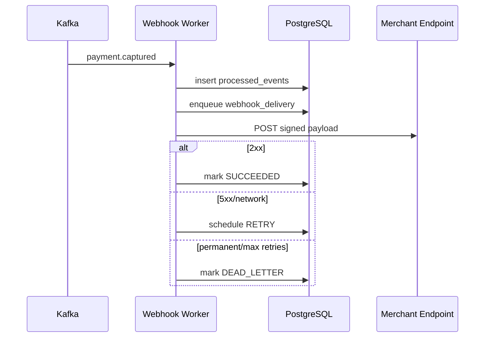

# Webhook Delivery

```mermaid
sequenceDiagram
  participant K as Kafka
  participant W as Webhook Worker
  participant DB as PostgreSQL
  participant E as Merchant Endpoint
  K->>W: payment.captured
  W->>DB: insert processed_events
  W->>DB: enqueue webhook_delivery
  W->>E: POST signed payload
  alt 2xx
    W->>DB: mark SUCCEEDED
  else 5xx/network
    W->>DB: schedule RETRY
  else permanent/max retries
    W->>DB: mark DEAD_LETTER
  end
```
