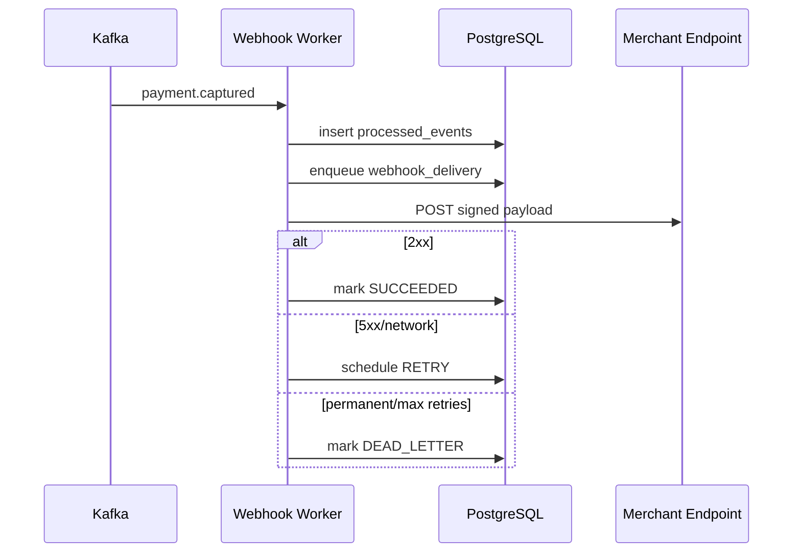

# Webhook Delivery

Each webhook endpoint has a unique active signing secret encrypted at rest with the configured
master key. Plaintext is returned only when the endpoint is created or when the secret is rotated.
Deliveries are signed with the endpoint's active secret and include both `ForgePay-Timestamp` and
`ForgePay-Signature`; receivers can reject stale timestamps to reduce replay risk.

Manual replay moves a delivery back to `PENDING` and records an audit event. It does not reset the
attempt counter, so retry history remains visible.
